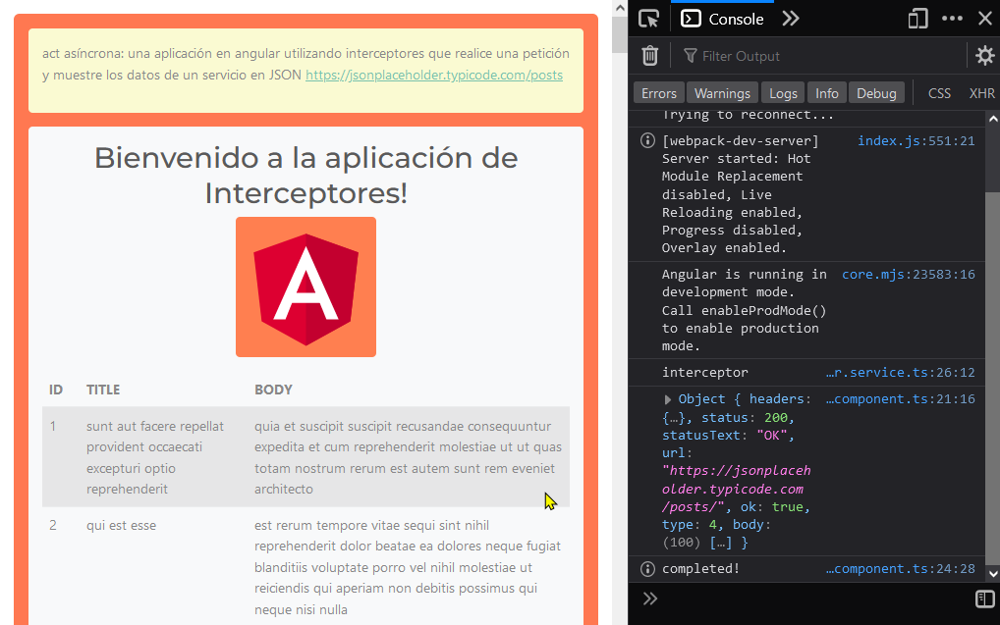

# Act20




en app.module.ts importar ``HttpClientModule
``

```
import { HttpClientModule } from '@angular/common/http';
```

y 

```
providers: [
{
provide: HTTP_INTERCEPTORS,
useClass: NombredetuinterceptorsService,
multi: true //indica que podemos tener multiples interceptors
}
],
```


en app-routing.module.ts

````
const routes: Routes = [
  {path:'',component: unComponent},
  {path:'otro', component: otroComponent},
];
```